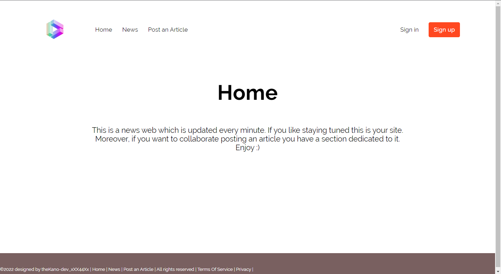
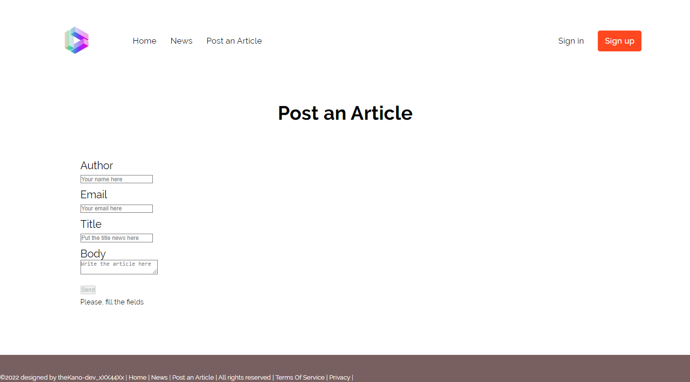

[![LinkedIn][linkedin-shield]][linkedin-url]

# React Project - News Page

  <h3 align="center">MERN STACK REACT PROJECT</h3>

  <p align="center">
    News Web made using Javascript, API , Node, Express and SASS.
    <br />
    <a href="https://github.com/sergiokano/React_News-Web"><strong>Explore the docs »</strong></a>
    <br />
    ·
    <a href="https://github.com/sergiokano/React_News-Web/issues">Report Bug</a>
    ·
    <a href="https://github.com/sergiokano/React_News-Web/issues">Request Feature</a>
  </p>
</div>

<!-- TABLE OF CONTENTS -->
<details>
  <summary>Table of Contents</summary>
  <ol>
        <li><a href="#objectives">Objectives</a></li>
    <li>
      <a href="#about-the-project">About The Project</a>
      <ul>
         <li><a href="#built-with">Built With</a></li>
      </ul>   
    </li>
    <li>
      <a href="#getting-started">Getting Started</a>
      <ul>
        <li><a href="#prerequisites">Prerequisites</a></li>
        <li><a href="#installation">Installation</a></li>
      </ul>
    </li>
    <li><a href="#preview">Preview</a></li>
    <li><a href="#future-roadmap">Future Roadmap</a></li>
    <li><a href="#contributing">Contributing</a></li>
    <li><a href="#license">License</a></li>
    <li><a href="#acknowledgments">Acknowledgments</a></li>
    <li><a href="#contact">Contact</a></li>
  </ol>
</details>

<!-- ABOUT THE OBJECTIVES -->

## Objectives

### 🚧 Made a REST API for the following:

<objectives>
  <ol>
    <li>Use a <a href="https://newsapi.org/">News API.</a></li>
    <li>Use React Router to: /home, /news, /postAnArticle.</a></li>
    <li>Create components: Header, Home, Form, Footer.</a></li>
    <li>Form to post a new article.</a></li>
    <li>Save the new article in Local Storage.</a></li>
    <li>Print the API News in the web.</a></li>
    <li>Create a footer.</a></li>
    <li>Use Context.</a></li>
    <li>Use SASS.</a></li>
    <li>Responsive Design.</a></li>

  </ol>
</objectives>

<!-- ABOUT THE PROJECT -->

## About The Project

This project is a React News Page using a API NEWS made with the objective of working with a real API to create the News cards in the News Web.


<p align="right">(<a href="#readme-top">back to top</a>)</p>

### Built With

- [![React][React.js]][react-url]
- [![Node][node.js]][node.js-url]
* [![SASS][SASS]][SASS-url]

<p align="right">(<a href="#readme-top">back to top</a>)</p>

<!-- GETTING STARTED -->

## Getting Started

This is an example of how you may give instructions on setting up your project locally.
To get a local copy up and running follow these simple example steps.

### Prerequisites

This is an example of how to list things you need to use the software and how to install them.

- npm
  ```sh
  npm install react-router-dom@6
  npm install sass
  npm install react-cookie-consent
  ```

### Installation

\_Below is an example of how you can instruct your audience on installing and setting up your app.

1. Clone the repo
   ```sh
   git clone https://github.com/sergiokano/React_News-Web
   ```
2. Install NPM packages
   ```sh
 npm install react-router-dom@6 sass react-cookie-consent
   ```
3. Ready to start!

```sh
npm start
```

<p align="right">(<a href="#readme-top">back to top</a>)</p>

<!-- PREVIEW -->
## Preview 

- Home general overview




- Post an Article general overview




<!-- FUTURE -->

## Future Roadmap

- [ ] Add Pagination in /news
- [ ] Add new CSS Design
- [ ] Change the theme page to Metaverse and Crypto News

<p align="right">(<a href="#readme-top">back to top</a>)</p>

<!-- CONTRIBUTING -->

## Contributing

Contributions are what make the open source community such an amazing place to learn, inspire, and create. Any contributions you make are **greatly appreciated**.

If you have a suggestion that would make this better, please fork the repo and create a pull request. You can also simply open an issue with the tag "enhancement".
Don't forget to give the project a star! Thanks again!

1. Fork the Project
2. Create your Feature Branch (`git checkout -b feature/YourName`)
3. Commit your Changes (`git commit -m 'Add some YourName'`)
4. Push to the Branch (`git push origin feature/YourName`)
5. Open a Pull Request

<p align="right">(<a href="#readme-top">back to top</a>)</p>

<!-- LICENSE -->

## License

This project is under license of Sergio Cano

<p align="right">(<a href="#readme-top">back to top</a>)</p>

<!-- ACKNOWLEDGMENTS -->

## Acknowledgments

Use this space to list my favourites NEWS WEB projects I have explored and inspired by while doing my app.

https://github.com/adrianhajdin/project_modern_ui_ux_gpt3
https://github.com/ilkeraltin/react-ssr-news
https://github.com/radikalex/react-news-web


<p align="right">(<a href="#readme-top">back to top</a>)</p>

<!-- CONTACT -->

## Contact

  <p align="center">
<a href = "mailto:sergiocano.design@gmail.com"></a>
    <a href="https://www.linkedin.com/in/sergiocano-frontend-backend-mern/" target="_blank"></a> 
</p>

<p align="right">(<a href="#readme-top">back to top</a>)</p>

---

👨‍💻️ Done by [sergiokano](https://github.com/sergiokano)

<!-- MARKDOWN LINKS & IMAGES -->
<!-- https://www.markdownguide.org/basic-syntax/#reference-style-links -->

[linkedin-shield]: https://img.shields.io/badge/-LinkedIn-black.svg?style=for-the-badge&logo=linkedin&colorB=555
[linkedin-url]: https://linkedin.com/in/sergiocano-dev
[product-screenshot]: images/screenshot.png
[next.js]: https://img.shields.io/badge/next.js-000000?style=for-the-badge&logo=nextdotjs&logoColor=white
[next-url]: https://nextjs.org/
[react.js]: https://img.shields.io/badge/React-20232A?style=for-the-badge&logo=react&logoColor=61DAFB
[react-url]: https://reactjs.org/
[vue.js]: https://img.shields.io/badge/Vue.js-35495E?style=for-the-badge&logo=vuedotjs&logoColor=4FC08D
[vue-url]: https://vuejs.org/
[angular.io]: https://img.shields.io/badge/Angular-DD0031?style=for-the-badge&logo=angular&logoColor=white
[angular-url]: https://angular.io/
[jwt]: https://img.shields.io/badge/JWT-black?style=for-the-badge&logo=JSON%20web%20tokens
[jwt-url]: https://jwt.io/
[vercel]: https://img.shields.io/badge/vercel-%23000000.svg?style=for-the-badge&logo=vercel&logoColor=white
[vercel-url]: https://vercel.com/
[mongodb]: https://img.shields.io/badge/MongoDB-%234ea94b.svg?style=for-the-badge&logo=mongodb&logoColor=white
[mongodb-url]: https://www.mongodb.com/es
[express.js]: https://img.shields.io/badge/express.js-%23404d59.svg?style=for-the-badge&logo=express&logoColor=%2361DAFB
[express.js-url]: https://expressjs.com/
[node.js]: https://img.shields.io/badge/node.js-6DA55F?style=for-the-badge&logo=node.js&logoColor=white
[node.js-url]: https://nextjs.org/
[postman]: https://img.shields.io/badge/Postman-FF6C37?style=for-the-badge&logo=postman&logoColor=white
[postman-url]: https://www.postman.com/
[SASS]: https://img.shields.io/badge/SASS-pink?style=for-the-badge&logo=SASS&logoColor=white
[SASS-url]: https://sass-lang.com/
